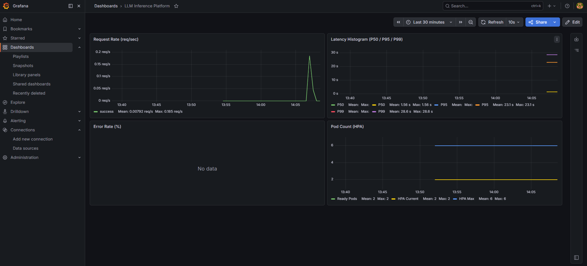

# LLM Inference Platform on Kubernetes

A production-style LLM inference platform built as part of an Advanced LLM Techniques course project, extended with full Kubernetes orchestration, HPA auto-scaling, and an observability stack.

Features containerized LLM serving with an OpenAI-compatible API, benchmark-driven architecture decisions, and a Prometheus + Grafana monitoring dashboard.


---

## Architecture

```
┌─────────────────────────────────────────────────────────────┐
│                        Client / Locust                       │
└──────────────────────────┬──────────────────────────────────┘
                           │ HTTP POST /v1/chat/completions
┌──────────────────────────▼──────────────────────────────────┐
│              Kubernetes Service (ClusterIP:8000)             │
│  ┌─────────────────┐  ┌─────────────────┐                   │
│  │  FastAPI Pod 1  │  │  FastAPI Pod 2  │  ← HPA: 2-6 pods  │
│  │  (llm-inference)│  │  (llm-inference)│                   │
│  └────────┬────────┘  └────────┬────────┘                   │
│           └──────────┬─────────┘                            │
│                      │ /metrics (Prometheus format)          │
│  ┌───────────────────▼─────────────────────────────────┐    │
│  │         ServiceMonitor → Prometheus → Grafana        │    │
│  └─────────────────────────────────────────────────────┘    │
└─────────────────────────────────────────────────────────────┘
                           │
              ┌────────────▼────────────┐
              │   Ollama + Phi-3 Mini   │
              │   (WSL2, GTX 1650 GPU)  │
              └─────────────────────────┘
```

---

## Tech Stack

| Layer | Tool | Purpose |
|-------|------|---------|
| Model Serving | Ollama + Phi-3 Mini (2.2GB) | GPU-accelerated LLM inference |
| API Layer | FastAPI + Python 3.11 | OpenAI-compatible `/v1/chat/completions` |
| Containerization | Docker (multi-stage build) | Slim production image |
| Orchestration | k3d (local Kubernetes) | k3s cluster inside Docker |
| Auto-scaling | Kubernetes HPA (autoscaling/v2) | CPU-based pod scaling (2→6) |
| Observability | Prometheus + Grafana | P95 latency, request rate, error rate |
| Load Testing | Locust 2.43.4 | Concurrent user simulation |
| OS / GPU | WSL2 Ubuntu 24.04 + NVIDIA GTX 1650 | CUDA 13.2, Driver 596.36 |

---

## Quick Start

```bash
# 1. Clone repo
git clone https://github.com/qw486759/llm-inference-platform
cd llm-inference-platform

# 2. Build Docker image
docker build -f docker/Dockerfile -t llm-inference:v1 .

# 3. Create k3d cluster and deploy
k3d cluster create llm-cluster --agents 2
k3d image import llm-inference:v1 -c llm-cluster
kubectl apply -f k8s/

# 4. Deploy observability stack
helm repo add prometheus-community https://prometheus-community.github.io/helm-charts
helm repo update
kubectl create namespace monitoring
helm install kube-prometheus-stack prometheus-community/kube-prometheus-stack \
  --namespace monitoring \
  --set grafana.adminPassword=admin123 \
  --set prometheus.prometheusSpec.serviceMonitorSelectorNilUsesHelmValues=false
kubectl apply -f monitoring/servicemonitor.yaml

# 5. Access services
kubectl port-forward svc/llm-inference 8000:8000        # API
kubectl port-forward svc/kube-prometheus-stack-grafana 3000:80 -n monitoring  # Grafana (admin/admin123)
```

---

## API Usage

```bash
curl -s http://localhost:8000/v1/chat/completions \
  -H "Content-Type: application/json" \
  -d '{
    "model": "phi3:mini",
    "messages": [{"role": "user", "content": "Explain Kubernetes HPA in one sentence."}],
    "stream": false
  }'
```

```json
{
  "id": "3b5a94ec",
  "object": "chat.completion",
  "model": "phi3:mini",
  "choices": [{
    "message": {"role": "assistant", "content": "..."},
    "finish_reason": "stop"
  }],
  "usage": {"prompt_tokens": 20, "completion_tokens": 45, "total_tokens": 65}
}
```


*OpenAI-compatible response from FastAPI wrapper running on Kubernetes*

---

## Kubernetes Deployment


*kubectl apply result: Deployment + HPA + Service created. HPA showing cpu: 3%/70% with 2 pods Running*

---

## Observability

Grafana dashboard (`monitoring/grafana-dashboard.json`) includes 4 panels:

- **Request Rate** — req/sec by status (success/error)
- **Latency Histogram** — P50, P95, P99 percentiles
- **Error Rate** — percentage of failed requests
- **Pod Count** — HPA current/max replicas over time

Import via: Grafana → Dashboards → New → Import → Upload JSON


*Live dashboard during Locust benchmark — Request Rate spikes, HPA scaling from 2→4 pods, P95 latency tracked in real time*


*Dashboard after initial 10-request test — P50=1.56s, P95=23.1s, 0% error rate, 2 Ready Pods*

---

## Benchmark Results

Tested under **10 concurrent users**, **60-second duration** on GTX 1650 Max-Q (4GB VRAM).

| Strategy | Pods | Failure Rate | P50 | P95 | Throughput |
|----------|------|:---:|:---:|:---:|:---:|
| A: Single Pod | 1 | **45.5%** ❌ | 15s | 35s | 0.37 req/s |
| B: HPA Dynamic | 2→6 | **0%** ✅ | 26s | 28s | 0.34 req/s |
| C: Pre-scaled | 4 | **0%** ✅ | 22s | **24s** | **0.40 req/s** |

**Key finding:** Single-pod deployment fails under minimal load (10 users). HPA eliminates failures with automatic cost optimization. Pre-scaling achieves best latency at higher resource cost.

→ Full analysis: [docs/adr-inference-strategy.md](docs/adr-inference-strategy.md)

---

### Scenario A — Single Pod (1 replica)


*Setup: 1 pod confirmed Running before test start*


*Result: 45.5% failure rate, P50=15s, P95=35s, 10x HTTP 502 — single pod overwhelmed by 10 concurrent users*

---

### Scenario B — HPA Dynamic (min=2, max=6)


*Setup: 2 pods Running (HPA min=2), scenario-b test starting*


*Result: 0% failure rate, P50=26s, P95=28s — HPA distributes load across pods*

---

### Scenario C — Pre-scaled (4 replicas)


*Setup: 4 pods all Running before test start*


*Result: 0% failure rate, P50=22s, P95=24s — best latency with pre-warmed pod pool*

---

## Key Design Decisions

See [docs/adr-inference-strategy.md](docs/adr-inference-strategy.md) for full Architecture Decision Record.

| Decision | Rationale |
|----------|-----------|
| `imagePullPolicy: Never` | Forces k3d to use locally imported image |
| `host.docker.internal` for Ollama URL | Container reaches WSL2 host via Docker gateway |
| HPA autoscaling/v2 | Supports multi-metric scaling; v1 deprecated |
| Multi-stage Dockerfile | Builder stage installs deps; runtime stage is slim |
| ServiceMonitor label `release: kube-prometheus-stack` | Required for Prometheus Operator auto-discovery |

---

## What I Learned

- **GPU passthrough in WSL2 requires Windows-side NVIDIA driver ≥ 470** — the Linux-side `nvidia-utils` package is not needed; WSL2 bridges directly to the Windows driver via `/dev/dxg`
- **HPA scale-up lag is a first-class concern for LLM workloads** — because inference requests take 10-30s each, a 30-60s scale-up window means queued requests time out before new pods help; pre-warming with `minReplicas=2` is essential
- **Prometheus ServiceMonitor label matching is the most common misconfiguration** — the `release:` label on the ServiceMonitor must exactly match the Helm release name, otherwise Prometheus Operator silently ignores the monitor

---

## Repo Structure

```
llm-inference-platform/
├── app/
│   ├── main.py                    # FastAPI inference wrapper
│   └── requirements.txt
├── docker/
│   └── Dockerfile                 # Multi-stage build
├── k8s/
│   ├── deployment.yaml            # 2 replicas, resource limits
│   ├── service.yaml               # ClusterIP:8000
│   └── hpa.yaml                   # min=2, max=6, CPU=70%
├── monitoring/
│   ├── servicemonitor.yaml        # Prometheus scrape config
│   └── grafana-dashboard.json     # 4-panel dashboard
├── benchmark/
│   ├── locustfile.py              # Load test script
│   └── results/                   # CSV outputs (A/B/C)
├── docs/
│   ├── adr-inference-strategy.md  # Architecture Decision Record
│   ├── phase1-setup-log.md
│   ├── phase2-setup-log.md
│   ├── phase3-setup-log.md
│   ├── phase4-setup-log.md
│   ├── phase5-benchmark-log.md
│   └── images/
│       ├── grafana-benchmark.png
│       ├── grafana-dashboard.png
│       ├── k8s-deploy-hpa.png
│       ├── k8s-api-response.png
│       ├── prometheus-metrics.png
│       ├── docker-api-response.png
│       ├── locust-scenario-a-start.png
│       ├── locust-scenario-a.png
│       ├── locust-scenario-b-start.png
│       ├── locust-scenario-b.png
│       ├── locust-scenario-c-start.png
│       └── locust-scenario-c.png
└── README.md
```

---

## Environment

| Component | Version |
|-----------|---------|
| OS | Windows 11 + WSL2 Ubuntu 24.04 |
| GPU | NVIDIA GTX 1650 Max-Q (4GB VRAM) |
| NVIDIA Driver | 596.36 |
| CUDA | 13.2 |
| Docker | 29.4.1 |
| k3d | v5.8.3 |
| kubectl | v1.36.0 |
| Helm | v3.20.2 |
| Ollama | 0.22.1 |
| Python | 3.11 (container) / 3.12 (WSL2) |
