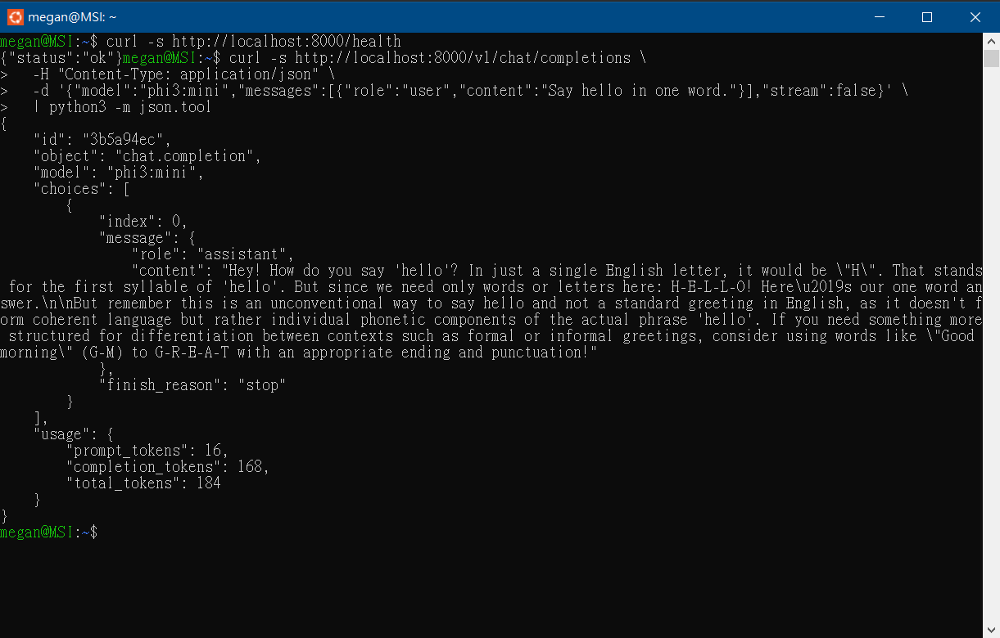
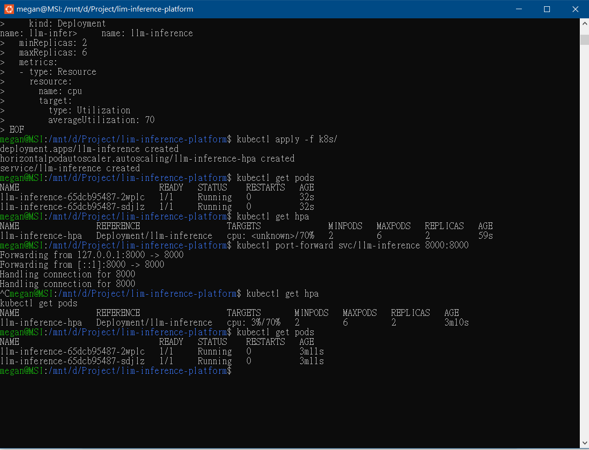
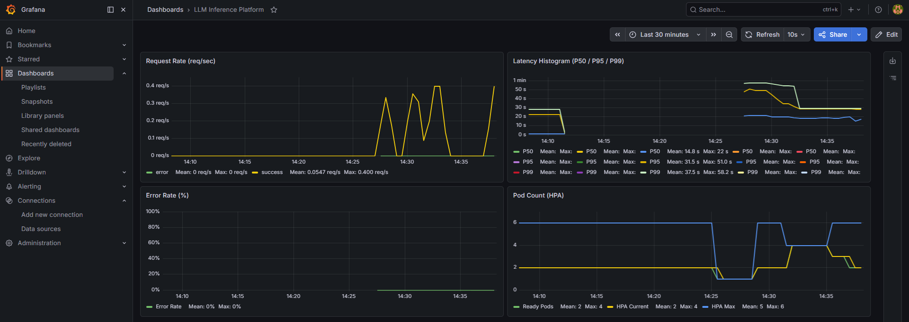
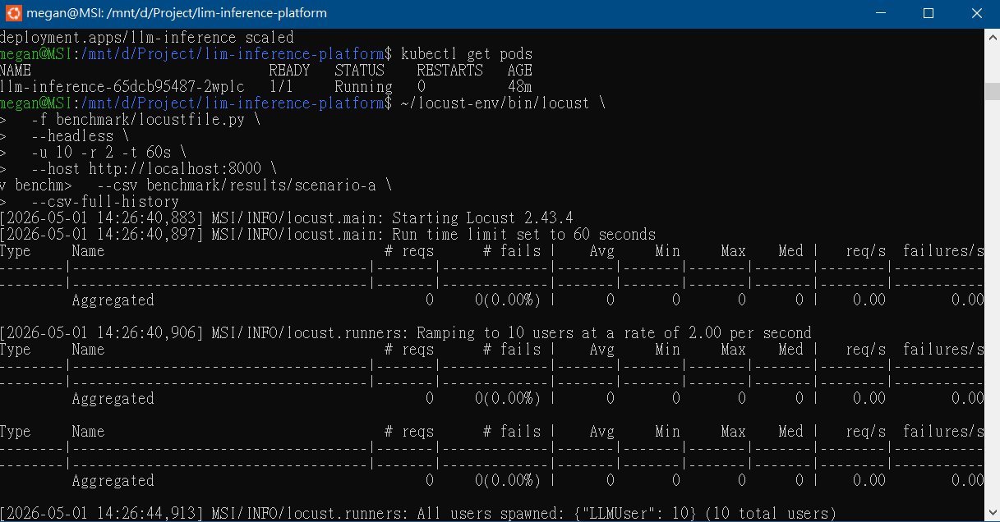
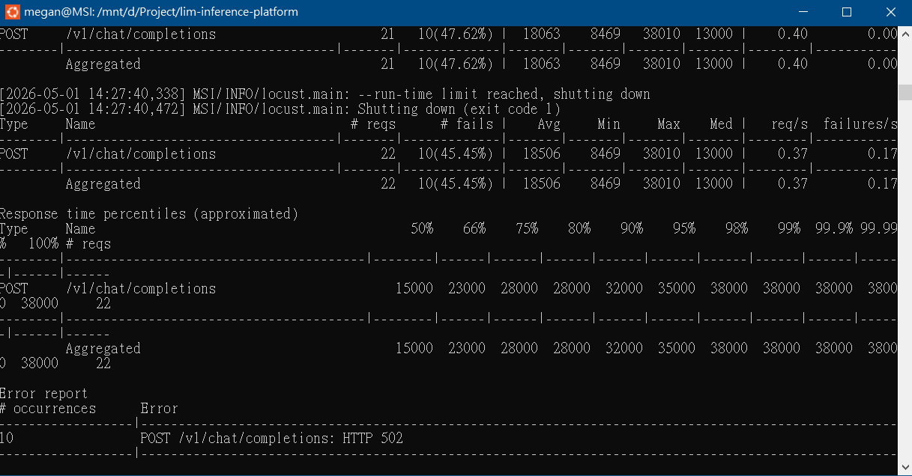
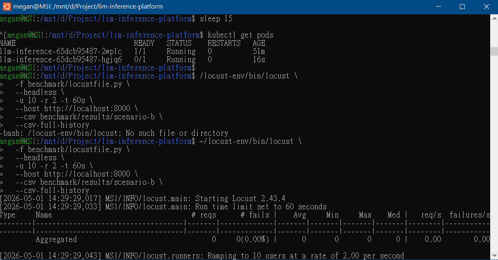
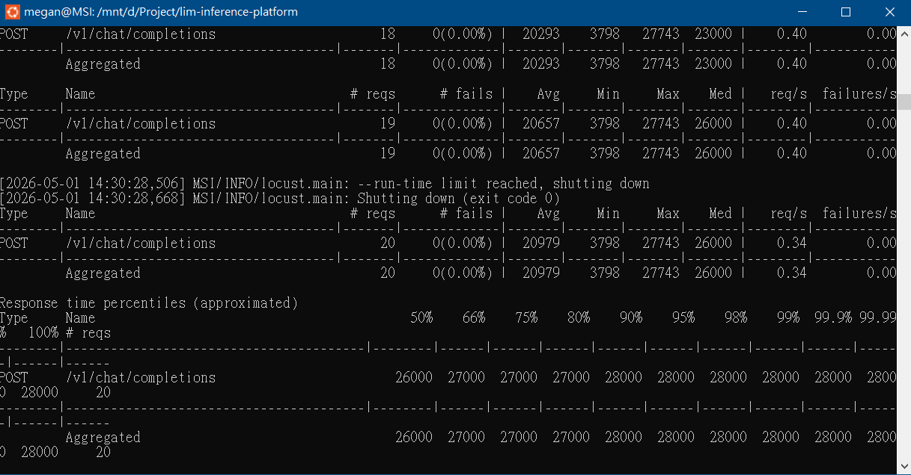
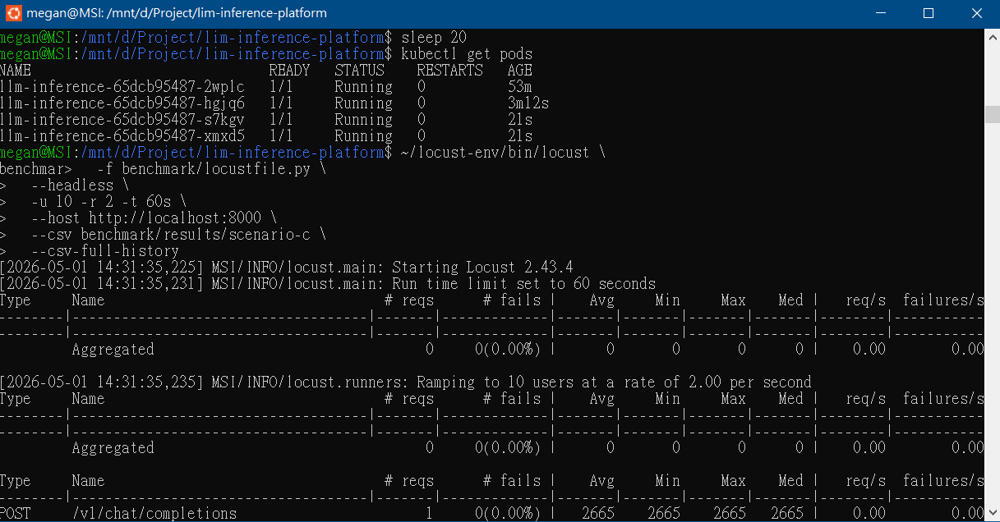
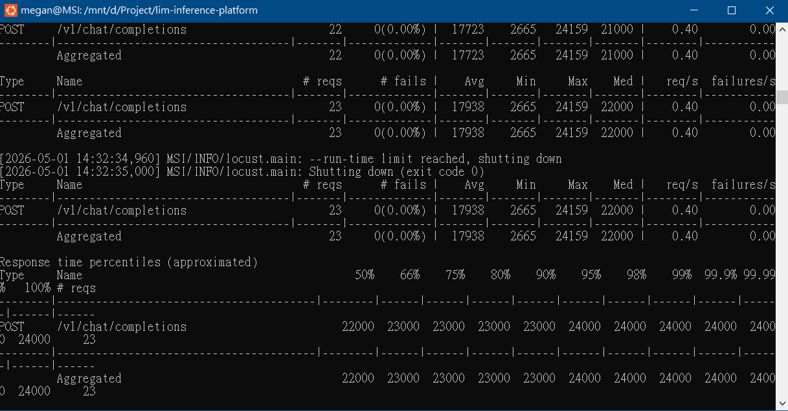

# GPU-Accelerated LLM Inference Platform on Kubernetes

A production-style LLM inference platform built to explore GPU-backed model serving, Kubernetes orchestration, and benchmark-driven architecture decisions. The project covers containerization, Kubernetes deployment with HPA auto-scaling, Prometheus/Grafana observability, and load-tested strategy comparisons across three scaling configurations.

The core question driving the architecture work: **how should a Kubernetes-based LLM inference service be scaled, and what are the measurable trade-offs between deployment strategies — given that all requests converge on a single GPU backend?**

Beyond request serving, the platform treats inference as an operational workload by layering alerting, validation workflows, and operator-facing runbooks on top of the core GPU/Kubernetes infrastructure.

---

## Architecture

```
┌──────────────────────────────────────────────────────────────┐
│                      Client / Locust                         │
└─────────────────────────┬────────────────────────────────────┘
                          │ POST /v1/chat/completions
┌─────────────────────────▼────────────────────────────────────┐
│             Kubernetes Service (ClusterIP:8000)              │
│  ┌──────────────────┐  ┌──────────────────┐                  │
│  │  FastAPI Pod 1   │  │  FastAPI Pod 2   │  ← HPA: 2–6 pods │
│  └────────┬─────────┘  └────────┬─────────┘                  │
│           └─────────────────────┘                            │
│                        /metrics                              │
│  ┌───────────────────────────────────────────────────────┐   │
│  │      ServiceMonitor → Prometheus → Grafana            │   │
│  └───────────────────────────────────────────────────────┘   │
└──────────────────────────────────────────────────────────────┘
                          │ HTTP /api/chat
             ┌────────────▼────────────┐
             │   Ollama + Phi-3 Mini   │
             │   GPU offload / model execution
             ├─────────────────────────┤
             │  NVIDIA GTX 1650 Max-Q  │
             │  4GB VRAM, CUDA 13.2    │
             │  ~20 tokens/sec         │
             └─────────────────────────┘
```

The FastAPI pods act as **stateless inference gateways**; actual model execution is GPU-accelerated through Ollama on the host NVIDIA GPU. This separation allows the project to study gateway-level scaling independently from GPU-bound inference capacity — a distinction that the benchmark results directly expose.

Prometheus scrapes `/metrics` from each pod through a Kubernetes `ServiceMonitor`, and Grafana renders the collected time-series data.

---

## Tech Stack

| Layer | Tool | Notes |
|-------|------|-------|
| Model Serving | Ollama + Phi-3 Mini (2.2 GB) | GPU-accelerated via GTX 1650 Max-Q, CUDA 13.2 |
| Inference API | FastAPI + Python 3.11 | OpenAI-compatible `/v1/chat/completions` |
| Containerization | Docker (multi-stage build) | Slim runtime image |
| Orchestration | k3d (local Kubernetes) | k3s cluster running inside Docker |
| Auto-scaling | Kubernetes HPA (autoscaling/v2) | CPU-based scaling, min=2 / max=6 pods |
| Observability | Prometheus + Grafana | Latency histograms, request rate, error rate, tokens/sec |
| Load Testing | Locust 2.43.4 | Headless concurrent-user simulation |
| Environment | WSL2 Ubuntu 24.04 + Windows 11 | NVIDIA Driver 596.36, CUDA 13.2 |

---

## Key Features

- OpenAI-compatible REST API; non-streaming responses follow the OpenAI chat completion schema; streaming mode proxies Ollama NDJSON chunks for local testing
- `/live` and `/ready` endpoints for Kubernetes liveness and readiness probes (readiness validates Ollama backend reachability)
- `/metrics` endpoint exposing Prometheus-format counters and histograms
- **`llm_tokens_per_second` metric** — per-request token generation rate observed as a Prometheus histogram, derived from Ollama's `eval_duration`; isolates GPU inference throughput from network and API overhead
- Multi-stage Dockerfile producing a minimal runtime image
- Kubernetes Deployment with CPU resource requests and limits
- Horizontal Pod Autoscaler targeting 70% average CPU utilization
- Grafana dashboard with request rate, P50/P95/P99 latency, error rate, pod count, and tokens/sec panels
- Benchmark suite comparing three deployment strategies under concurrent load
- `k8s/examples/gpu-deployment.example.yaml` — production reference manifest using NVIDIA Device Plugin

---

## Quick Start

Before deploying the Kubernetes gateway, ensure Ollama is running on the host and `phi3:mini` has been pulled:

```bash
# 0. Start Ollama and pull the model (skip if already running)
ollama serve &
ollama pull phi3:mini
curl -s http://localhost:11434/api/tags
```

```bash
# 1. Clone the repository
git clone https://github.com/qw486759/llm-inference-platform
cd llm-inference-platform

# 2. Build the Docker image
docker build -f docker/Dockerfile -t llm-inference:v2 .

# 3. Create a local k3d cluster and deploy
k3d cluster create llm-cluster --agents 2
k3d image import llm-inference:v2 -c llm-cluster
kubectl apply -f k8s/

# 4. Deploy the observability stack
helm repo add prometheus-community https://prometheus-community.github.io/helm-charts
helm repo update
kubectl create namespace monitoring
helm install kube-prometheus-stack prometheus-community/kube-prometheus-stack \
  --namespace monitoring \
  --set grafana.adminPassword=admin123 \
  --set prometheus.prometheusSpec.serviceMonitorSelectorNilUsesHelmValues=false
kubectl apply -f monitoring/servicemonitor.yaml

# 5. Access the services
kubectl port-forward svc/llm-inference 8000:8000
kubectl port-forward svc/kube-prometheus-stack-grafana 3000:80 -n monitoring
```

Grafana is available at `http://localhost:3000` (credentials: `admin` / `admin123`).  
Import `monitoring/grafana-dashboard.json` to load the pre-built dashboard.

---

## API Usage

```bash
curl -s http://localhost:8000/v1/chat/completions \
  -H "Content-Type: application/json" \
  -d '{
    "model": "phi3:mini",
    "messages": [{"role": "user", "content": "Explain Kubernetes HPA in one sentence."}],
    "stream": false
  }'
```

**Response:**
```json
{
  "id": "3b5a94ec",
  "object": "chat.completion",
  "model": "phi3:mini",
  "choices": [{
    "index": 0,
    "message": {"role": "assistant", "content": "..."},
    "finish_reason": "stop"
  }],
  "usage": {
    "prompt_tokens": 20,
    "completion_tokens": 45,
    "total_tokens": 65
  }
}
```



---

## Kubernetes Deployment

The service is deployed as a Kubernetes `Deployment` with two initial replicas, a `ClusterIP` Service, and a `HorizontalPodAutoscaler`. Resource limits (`500m` CPU, `512Mi` memory) are set per pod to prevent resource contention in the local cluster.

```bash
kubectl apply -f k8s/
kubectl get pods
kubectl get hpa
```

A production GPU deployment reference is available at `k8s/examples/gpu-deployment.example.yaml`, documenting the migration path to GPU-enabled Kubernetes nodes using the NVIDIA Device Plugin (`nvidia.com/gpu: 1` resource request).



---

## Observability

Prometheus scrapes `/metrics` from each pod every 15 seconds via a `ServiceMonitor` resource. The Grafana dashboard tracks key service and inference metrics:

| Panel | Metric |
|-------|--------|
| Request Rate | `rate(llm_requests_total[1m])` |
| Latency Histogram | P50, P95, P99 via `histogram_quantile` |
| Error Rate | Error requests as a fraction of total |
| Pod Count | HPA current and maximum replica counts |
| **Tokens/sec** | `llm_tokens_per_second` — per-request token generation rate observed as a Prometheus histogram, derived from Ollama `eval_duration` |



---

## Operational Use Case

This platform frames GPU-backed LLM inference as an operational workload, not only an application endpoint. In addition to serving OpenAI-compatible responses, the system exposes service-level and inference-level signals that help operators reason about latency, throughput, reliability, and scaling limits.

The observability layer is designed to answer:

- Is the inference gateway healthy under concurrent traffic?
- Does HPA improve reliability, or only redistribute queue pressure?
- Is throughput limited by gateway replicas or by the shared GPU runtime?
- Which metrics should trigger alerts before user-facing degradation occurs?

Benchmark results and the Architecture Decision Record address these questions through measured scaling comparisons and GPU bottleneck analysis. For operational validation and day-2 operations, see [`docs/poc-plan.md`](docs/poc-plan.md) and [`docs/operator-runbook.md`](docs/operator-runbook.md).

---

## Benchmark

### Methodology

Three deployment strategies were benchmarked under identical workload conditions to measure the trade-offs between reliability, latency, throughput, and resource usage.

| Parameter | Value |
|-----------|-------|
| Tool | Locust 2.43.4 |
| Concurrent users | 10 |
| Ramp rate | 2 users/sec |
| Duration | 60 seconds |
| Prompt | Fixed ~50-token prompt (HPA explanation) |
| Max tokens | 50 |

**Scenarios:**
- **A — Single pod:** 1 replica, HPA disabled
- **B — HPA dynamic:** min=2, max=6 pods, CPU target=70%
- **C — Pre-scaled:** 4 static replicas, HPA disabled

### Results

| Strategy | Gateway Pods | GPU Backend | Failure Rate | P50 | P95 | Throughput | Bottleneck |
|----------|:---:|:---:|:---:|:---:|:---:|:---:|:---|
| A: Single pod | 1 | 1× GTX 1650 | **45.5%** ❌ | 15s | 35s | 0.37 req/s | API queue overflow + GPU serialization |
| B: HPA dynamic | 2→6 | 1× GTX 1650 | **0%** ✅ | 26s | 28s | 0.34 req/s | HPA warm-up lag + shared GPU backend |
| C: Pre-scaled | 4 | 1× GTX 1650 | **0%** ✅ | 22s | **24s** | **0.40 req/s** | Shared GPU backend |

**Scenario A — Single pod**




**Scenario B — HPA dynamic scaling**




**Scenario C — Pre-scaled static fleet**




### Interpretation

Single-pod deployment fails under modest load due to Ollama's serial request queue overflowing (HTTP 502). Both multi-pod configurations eliminated failures in this benchmark.

A key finding emerges from the throughput numbers: **adding gateway pods from 2 to 4 increases throughput by only 0.06 req/s** (0.34 → 0.40 req/s). This near-flat throughput curve reveals that the bottleneck is the **shared GPU backend**, not the API gateway layer. All requests — regardless of pod count — ultimately serialize through the single Ollama runtime on the host GPU.

This exposes two distinct scaling dimensions:
- **Gateway scalability** — handled by Kubernetes HPA; reduced gateway-side queue overflow and 502 errors in this test
- **Accelerator capacity** — fixed by hardware; true horizontal scaling requires multiple GPU nodes or a batching-capable runtime (vLLM, Triton)

Pre-scaling achieves the lowest P95 latency (24s) because pods are already warm when requests arrive. HPA dynamic scaling introduces a 30–60 second scale-up lag, temporarily increasing latency during the ramp-up window, but reduces idle resource cost during low-traffic periods.

### Limitations

These results should be interpreted within the constraints of the test environment:

- **Local k3d cluster** running inside Docker on a single Windows host — not representative of a multi-node cloud deployment
- **GTX 1650 Max-Q (4GB VRAM)** — a consumer-grade GPU (~20 tokens/sec); inference throughput and latency would differ significantly on production hardware (e.g., NVIDIA A10G at ~200+ tokens/sec)
- **10 concurrent users** — a small-scale workload; behavior at 50–500 users is not captured
- **CPU-based HPA** — LLM inference load is not well-reflected by CPU utilization; KEDA with queue depth or tokens/sec would be a more accurate scaling signal

---

## Architecture Decision Record

A full ADR is available at [`docs/adr-inference-strategy.md`](docs/adr-inference-strategy.md), including GPU bottleneck analysis and production deployment path. Key decisions are summarized below.

| Decision | Rationale |
|----------|-----------|
| FastAPI as inference layer | Async support for concurrent requests; OpenAI-schema compatibility; built-in Prometheus integration |
| Docker multi-stage build | Separates dependency installation from runtime image, reducing size and attack surface |
| Kubernetes + HPA | Declarative replica management and reactive scaling; separates infrastructure from application code |
| CPU-based HPA at 70% | Practical threshold for local constraints; KEDA with request queue depth would be more accurate for LLM workloads |
| Prometheus + Grafana | Standard Kubernetes observability stack; ServiceMonitor enables automatic scrape target discovery |
| `llm_tokens_per_second` metric | Uses Ollama `eval_duration` (pure GPU execution time) rather than end-to-end latency, isolating accelerator throughput from network overhead |
| Benchmark: three strategies | Isolates effect of pod count and scaling behavior; provides data to justify deployment recommendation |

**Recommendation:** HPA dynamic scaling (Scenario B) for variable-traffic workloads. Pre-scaling (Scenario C) preferred when latency is the primary constraint and traffic is predictable. For true throughput scaling, replace Ollama with vLLM or Triton on GPU-enabled nodes.

---

## Repo Structure

```
llm-inference-platform/
├── app/
│   ├── main.py                    # FastAPI inference wrapper + Prometheus metrics
│   └── requirements.txt
├── docker/
│   └── Dockerfile                 # Multi-stage build
├── k8s/
│   ├── deployment.yaml
│   ├── service.yaml
│   ├── hpa.yaml
│   └── examples/
│       └── gpu-deployment.example.yaml  # Production GPU node reference (NVIDIA Device Plugin)
├── monitoring/
│   ├── servicemonitor.yaml
│   ├── grafana-dashboard.json
│   └── inference-alerts.yml       # Prometheus alerting rules (degradation detection)
├── benchmark/
│   ├── locustfile.py
│   └── results/                   # Locust CSV outputs (A / B / C)
├── docs/
│   ├── adr-inference-strategy.md  # Full ADR with GPU bottleneck analysis
│   ├── poc-plan.md                # POC validation runbook
│   ├── operator-runbook.md        # Day-2 operations and runtime evaluation guide
│   └── validation-report.md       # E2E validation report — 22 checks, 3 issues found and fixed
│   ├── phase1-setup-log.md
│   ├── phase2-setup-log.md
│   ├── phase3-setup-log.md
│   ├── phase4-setup-log.md
│   ├── phase5-benchmark-log.md
│   └── images/
└── README.md
```

---

## Environment

| Component | Version |
|-----------|---------|
| OS | Windows 10 + WSL2 Ubuntu 24.04 |
| GPU | NVIDIA GTX 1650 Max-Q (4GB VRAM) |
| NVIDIA Driver | 596.36 |
| CUDA | 13.2 |
| Docker | 29.4.1 |
| k3d | v5.8.3 |
| kubectl | v1.36.0 |
| Helm | v3.20.2 |
| Ollama | 0.22.1 |
| Python | 3.11 (container) / 3.12 (WSL2) |

---

## Troubleshooting

### HPA shows `<unknown>` for CPU target

HPA requires the Kubernetes Metrics API (`metrics-server`) to read CPU utilization. Verify it is running:

```bash
kubectl top pods
```

If this command fails, metrics-server may not be available in your k3d cluster. Enable it with:

```bash
kubectl apply -f https://github.com/kubernetes-sigs/metrics-server/releases/latest/download/components.yaml
```

### Ollama unreachable from pod

If `/ready` returns 503, the FastAPI pod cannot reach Ollama on the host. Verify:

```bash
# From WSL2
curl http://host.docker.internal:11434/api/tags
```

If this fails, ensure Ollama is running (`ollama serve`) and Docker Desktop has host networking enabled.

### Pod stuck in `ErrImageNeverPull`

The image tag in `k8s/deployment.yaml` does not match what was imported into k3d. Verify:

```bash
docker images | grep llm-inference
k3d image import llm-inference:v2 -c llm-cluster
```

---

## Further Documentation

| Document | Purpose |
|----------|---------|
| [`docs/adr-inference-strategy.md`](docs/adr-inference-strategy.md) | Architecture Decision Record — GPU bottleneck analysis, strategy comparison, production path |
| [`docs/poc-plan.md`](docs/poc-plan.md) | POC validation runbook — environment prerequisites, deployment phases, success criteria |
| [`docs/operator-runbook.md`](docs/operator-runbook.md) | Operator guide — Grafana interpretation, runtime evaluation, GPU bottleneck checklist, HPA tuning |
| [`docs/validation-report.md`](docs/validation-report.md) | E2E validation report — 22 checks across all phases, 3 issues found and fixed during testing |
| [`monitoring/inference-alerts.yml`](monitoring/inference-alerts.yml) | Prometheus alert rules — latency degradation, error rate, HPA capacity, service availability |
